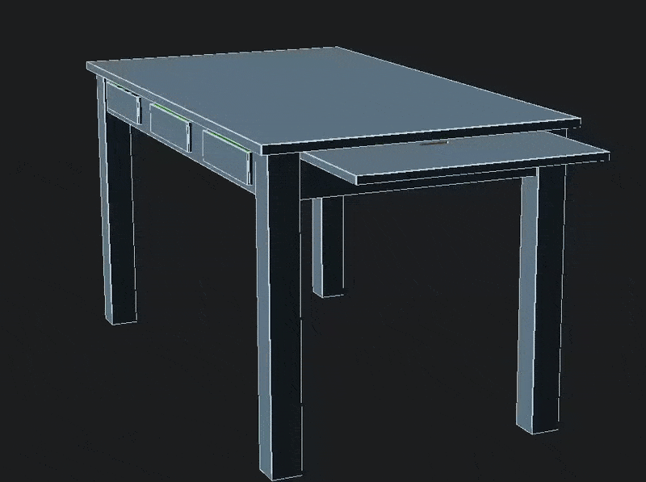
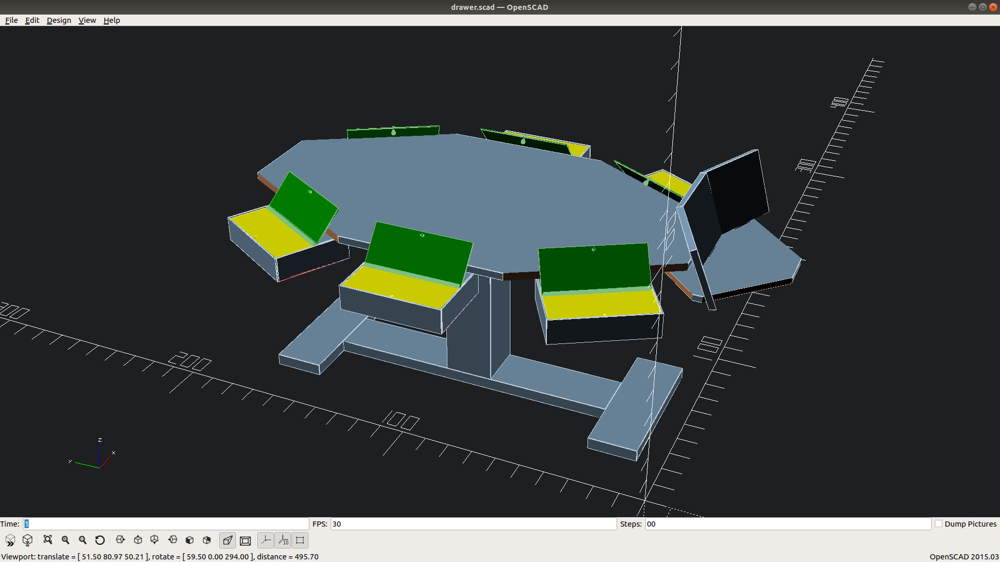

# DnD Table

This is a small side project where I am building a table for Dungeons&Dragons as well as tabletop games as a christmas gift for my girlfriend.

Whenever I feel like it I will update this repository to protocol my progress.

So far I have a rough concept for the drawers as CAD model using openSCAD:

## First Update

I started adding the table itself and ran into some difficulties with the handle that opens the lid, that still have to be figured out. 
Furthermore I noticed, that the drawer kind of needs some space at its end that stays under the table for stability of the drawers and for being able to open the lids of the drawers.

Additionally I started adding the drawer(?) for the DM-Screen and realized that managing angles is hard :D

So by now the thing looks like this (keep in mind so far it is about concept... not design):

Tomorrow, I intend to figure out the difficulties with the DM-Screen and put the USB-Slots into the drawers. Maybe I even manage to figure out the drawer handles

## Second Update:

Ok, no USB-Slots... Despite all my efforts it still looked kind of dull, so after some feedback I tried an octagonal shape for the table and I think it looks better. Also the DM-Screen does not look too shabby right now.

