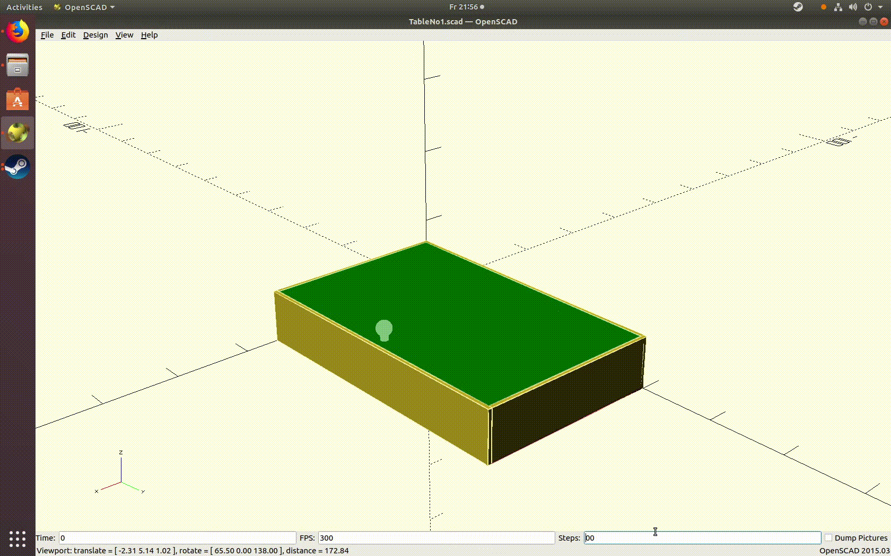

# DnD Table

This is a small side project where I am building a table for Dungeons&Dragons as well as tabletop games as a christmas gift for my girlfriend.

Whenever I feel like it I will update this repository to protocol my progress.

So far I have a rough concept for the drawers as CAD model using openSCAD:

